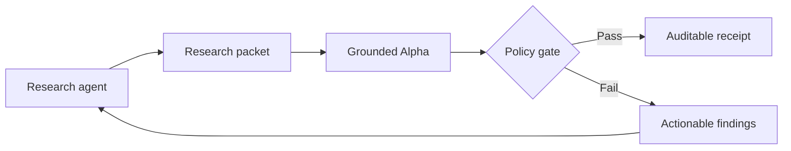

# Grounded Alpha

[](https://github.com/Apurva3509/grounded-alpha/actions/workflows/ci.yml)
[](pyproject.toml)
[](LICENSE)

**Your financial agent wrote a thesis. Grounded Alpha asks for receipts.**

Grounded Alpha is a local, deterministic evaluation harness for AI-generated
investment research. It checks whether claims are cited, sources existed at the
research cutoff, high-confidence conclusions have independent support and
counter-evidence, and repeated metrics agree.

No model, API key, brokerage connection, or financial data upload is required.

> Grounded Alpha evaluates research quality. It does not predict returns or
> provide financial advice.

## Why this exists

Financial agents can generate a polished thesis faster than a human can verify
it. Conventional LLM judges add another probabilistic opinion. Grounded Alpha
creates a deterministic evidence gate that runs identically in a terminal,
agent loop, or CI job.



## What it catches

- Fact and estimate claims without citations
- Sources published or accessed after the research cutoff
- Stale evidence under a configurable freshness policy
- High-confidence claims supported by only one source domain
- High-confidence claims that ignore counter-evidence
- Numeric claims missing metric, value, unit, or period metadata
- Conflicting values for the same metric, period, and unit
- Sources that are included but never connected to a claim
- Thin risk sections that do not challenge the thesis

Every report includes a SHA-256 receipt of the canonical research packet.

## Quick start

Install from source with [uv](https://docs.astral.sh/uv/):

```bash
uv tool install git+https://github.com/Apurva3509/grounded-alpha
grounded-alpha examples/research-packet.json
```

Or run directly from a checkout:

```bash
uv sync --group dev
uv run grounded-alpha examples/research-packet.json
uv run grounded-alpha examples/research-packet.json --format json
uv run grounded-alpha examples/research-packet.json \
  --policy examples/strict-policy.toml \
  --output audit.md
```

The included synthetic packet passes the default gate:

```text
# Grounded Alpha audit: Northstar Semiconductor

**PASS · 100/100**
```

Failing audits exit with status `1`, so agent loops and CI workflows can stop
before unsupported research is published. Invalid packets or policies exit with
status `2`.

## GitHub Action

Gate research artifacts in pull requests and append the complete audit to the
workflow summary:

```yaml
permissions:
  contents: read

steps:
  - uses: actions/checkout@v4
  - uses: Apurva3509/grounded-alpha@main
    with:
      packet: research/company.json
      policy: research/policy.toml
```

The step fails when the packet violates an error-level rule or scores below the
configured threshold.

## Agent skill

The reusable skill in [`skills/grounded-alpha`](skills/grounded-alpha/SKILL.md)
teaches Codex, Claude Code, and compatible agents to produce the packet format,
respect the as-of boundary, run the audit, and repair research without gaming
the score.

Copy the directory into your agent's local skills folder or reference it from
an existing harness.

## Research packet

Agents submit a JSON packet containing a thesis, claims, sources, and explicit
risks. Numeric claims become comparable when they include `metric`, `value`,
`unit`, and `period`.

```json
{
  "subject": "Example Company",
  "as_of": "2026-08-20",
  "thesis": "A concise, falsifiable investment thesis.",
  "sources": [
    {
      "id": "filing-1",
      "title": "Annual filing",
      "url": "https://filings.example/company/2026",
      "published_at": "2026-08-01",
      "accessed_at": "2026-08-20",
      "quote": "The exact excerpt supporting a claim.",
      "type": "filing"
    }
  ],
  "claims": [
    {
      "id": "revenue-growth",
      "text": "Revenue grew 18 percent.",
      "kind": "fact",
      "confidence": 0.9,
      "source_ids": ["filing-1"],
      "metric": "revenue_growth",
      "value": 0.18,
      "unit": "ratio",
      "period": "FY2026",
      "counterevidence": "Demand indicators weakened late in the period."
    }
  ],
  "risks": ["Customer concentration", "Demand normalization"]
}
```

Allowed claim kinds are `fact`, `estimate`, and `opinion`. Allowed source types
are `filing`, `earnings`, `market_data`, `research`, `news`, and `other`.

## Policy

Use a TOML policy to adjust the evidence gate:

```toml
[policy]
max_source_age_days = 120
high_confidence_threshold = 0.75
min_risks = 3
min_independent_sources = 2
max_numeric_conflict_ratio = 0.03
fail_below = 80
```

## Design principles

- **Evidence before eloquence:** prose cannot compensate for missing provenance.
- **Deterministic before probabilistic:** the base gate is reproducible and free.
- **As-of means as-of:** look-ahead evidence fails the audit.
- **Agent-agnostic:** any model or harness can emit the packet format.
- **Local-first:** research packets never leave the machine running the audit.

## Development

```bash
uv sync --group dev
uv run ruff check src tests
uv run ruff format --check src tests
uv run python -m unittest discover -s tests -v
uv build
```

## License

[MIT](LICENSE)
